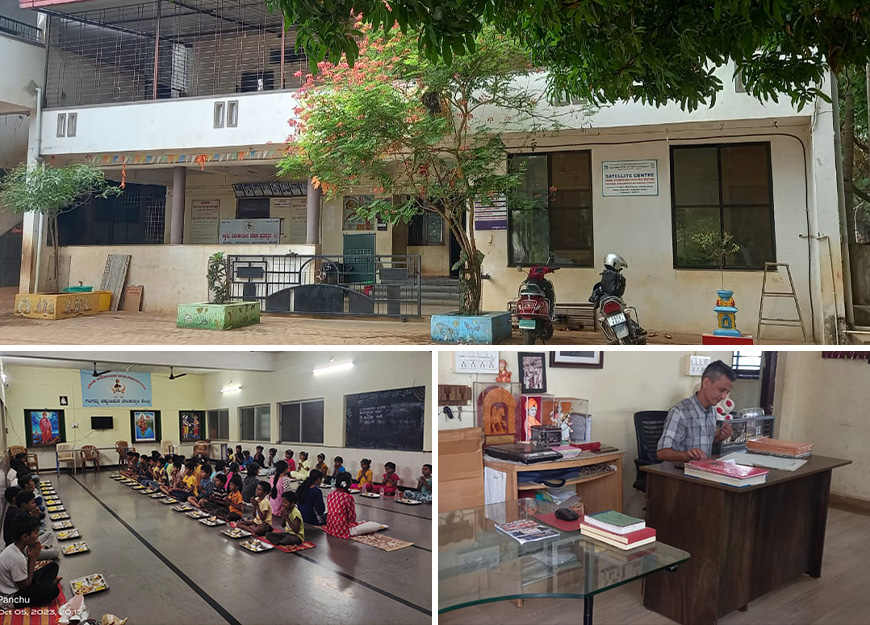

Swami Vivekanand Seva Pratishthan is a name that evokes a sense of wholehearted service to the society. It was established as a Trust in 1982 and registered under the Bombay Public Trust Act 1950 (Registration No. E556BGM on 04-06-1982). The name bears a significance, because it is the same of one of India’s greatest saints of the twentieth century, Swami Vivekanand. The mission to start this organization was to serve the orphaned, abandoned, destitute and the less privileged children of the society.

## OBJECTIVES OF THE ORGANIZATION:

<ul class="objectives-list">
    <li>Providing good quality education for the welfare of orphaned children</li>
    <li>Taking care of the nurture and safety of single parent children.</li>
    <li>Providing free food, shelter, education, protection to children.</li>
    <li>Providing medical facility, counseling service.</li>
    <li>Rehabilitation.</li>
    <li>Abandoned, lost and surrendered children can be adopted by the adoptive parents as per Central Government's CARA rules.</li>
</ul>

## Information about staff

    
<strong>Administrator:</strong> Mr. Rudro Nadagouda

    

      

        
<strong>Staff:</strong>

        <ul>
            <li>Social Workers - 02</li>
            <li>Counselor - 01</li>
            <li>Doctor - 01</li>
            <li>Wardens - 02</li>
            <li>Staff Nurse - 01</li>
            <li>Cooks - 02</li>
        </ul>
      

      

        <ul>
          <li>Accountant- 01</li>
          <li>Accounts officer -01</li>
          <li>Supervisor - 01</li>
          <li>Caretakers (06) – Mission Vatsalya</li>
          <li>Sweeper - 01</li>
        </ul>
    

    

## General information

<table class="info-table">
    <thead>
        <tr>
            <th>S. No.</th>
            <th>Particulars</th>
            <th>Count</th>
        </tr>
    </thead>
    <tbody>
        <tr>
            <td>1</td>
            <td>Children adopted or taken in foster care by families</td>
            <td>127</td>
        </tr>
        <tr>
            <td>2.</td>
            <td>Children taken for inter country adoption</td>
            <td>12</td>
        </tr>
        <tr>
            <td>3.</td>
            <td>Daughters of the center who have been happily married and their wedding arrangements made by the center.</td>
            <td>08</td>
        </tr>
    </tbody>
</table>

The Swami Vivekanand Seva Pratishthan runs two children’s home, one for boys and the other for girls, each with a capacity of 25 children. Both these homes have clean, well ventilated rooms, ample space for playing and learning, clean and hygienic washrooms and separate residence for wardens and caretakers on campus.

Children benefit from regular heath checkups and get timely, freshly cooked nutritious food prepared in the large kitchen. A positive and disciplined environment ensures our children lead as normal lives as possible, making them good citizens and better human beings. The center has a capacity to house an additional 25 boys and 25 girls if needed.

    <h3 style="margin-bottom: 1rem; color: #333;">BECOME A PROUD VOLUNTEER</h3>
    
Join your hand with us for a better life and beautiful future. Save The Life To Make The Better World

    <a href="/contact" class="theme_btn" style="display: inline-block; padding: 10px 20px; background-color: #e74c3c; color: white; text-decoration: none; border-radius: 5px;">Contact us</a>

