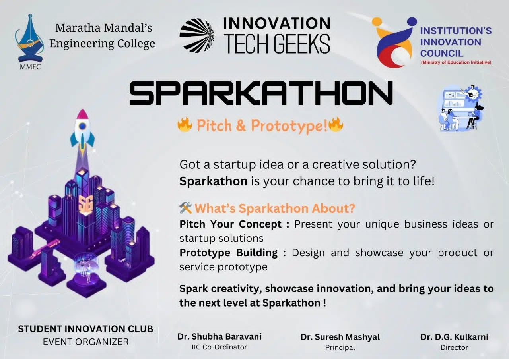

## 💡 Sparkathon: Empowering Ideas, Building Confidence

The **Sparkathon** Hackathon was an exhilarating opportunity for students to showcase their creativity and entrepreneurial spirit! Participants pitched business ideas, created prototypes, and applied the website development skills they learned at the **StartUp Spark Workshop**.  

This event wasn’t just about creating; it was about **conquering stage fears**, fostering collaboration, and inspiring confidence to present ideas effectively.

### 🌟 Highlights of Sparkathon
1. **Pitching Business Ideas**  
   Students presented innovative startup ideas and creative solutions.

2. **Prototyping & Showcasing**  
   Participants built websites as a visual representation of their ideas, showcasing their skills and creativity.

3. **Teamwork and Growth**  
   - Some participants collaborated to overcome challenges.  
   - Others presented independently, taking their first steps toward confident public speaking.

4. **Learning by Doing**  
   The event focused on helping participants enhance their presentation and technical skills in a supportive environment.



---

### 🎥 Relive the Event!
We captured the enthusiasm and creativity of all the participants in this video. See their websites, hear their pitches, and join us in celebrating their achievements!  


---

### 🌐 Participant Websites
Here are some of the amazing websites built and presented during Sparkathon (Click on the Links to view the Websites) :  

- **Prathmesh Pise**: [Portfolio Website](https://prathmeshpise.github.io/PrathmeshPise03.github.io/)  
- **Team STAR**: [Team Website](https://rabiyakazi.github.io/)  
- **MohammadSameed ChamanMalik**: [Portfolio Website](https://mohammadsameed.github.io/)  
- **Vikas Hanamant Rathod**: [Personal Website](https://vicky010101.github.io/vikas/)  
- **Ashish K**: [Portfolio Website](https://ashish720-ctrl.github.io/)  
- **Ariyan Pujari**: [News Website](https://ariyan9907.github.io/news_web/)  

---

### ✨ The Journey Continues
Sparkathon was more than a competition; it was a stepping stone for our students to grow, innovate, and thrive. With every pitch and every website, they took a step toward a brighter, more confident future.  

Let’s keep sparking ideas, creating opportunities, and building dreams! 🚀
