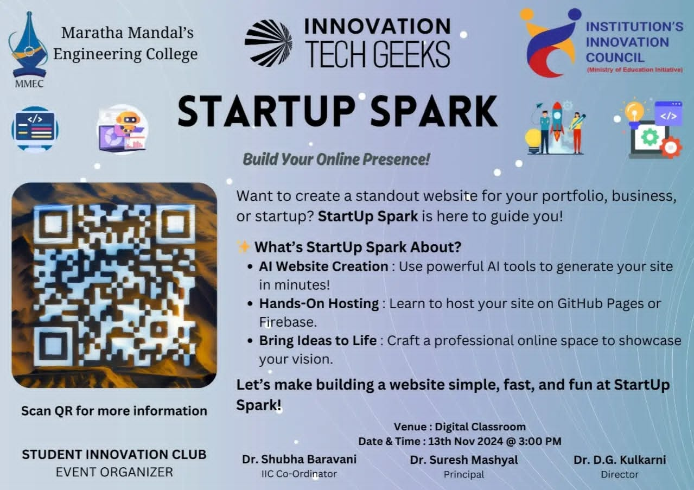

## 🌟 StartUp Spark: Unleashing Creativity with AI-Powered Tools

The **StartUp Spark Workshop** was all about empowering students to take their first steps in website development! Designed for beginners, this event introduced participants to cutting-edge AI tools and practical hosting solutions, enabling them to create stunning, functional websites for portfolios, businesses, or startups.

### 🛠 What We Did
1. **AI Tools for Website Building**  
   Participants explored advanced tools like:
   - **Fronty**: Converting images to websites.  
   - **Dora**, **Websim**, and **Mixo**: Generating websites from simple prompts.

2. **Hands-On Learning**  
   - Generated frontend designs using AI tools.  
   - Extracted and customized generated files.  
   - Uploaded static sites to **GitHub Pages** or used **Firebase Hosting** for deployment.

3. **Real-World Application**  
   Students applied their skills to create websites that reflect their personal or business ideas.  
   By the end of the workshop, participants had practical experience with modern tools and the confidence to showcase their creativity.



### 🎥 Learn and Create
Missed the workshop or want to revisit the steps? Watch our YouTube video where we guide you through hosting your website. This video provides valuable insights for beginners!  

Learn to build Websites, Reffering this YouTube Video made by Vighnesh Nilajakar 👇



### ✨ What’s Next?  
The skills learned in the workshop were put to the test at **Sparkathon**, where participants pitched business ideas and showcased their websites as prototypes. It’s just the beginning of their journey to innovation and confidence!

Let’s continue to create, innovate, and inspire. 🚀
