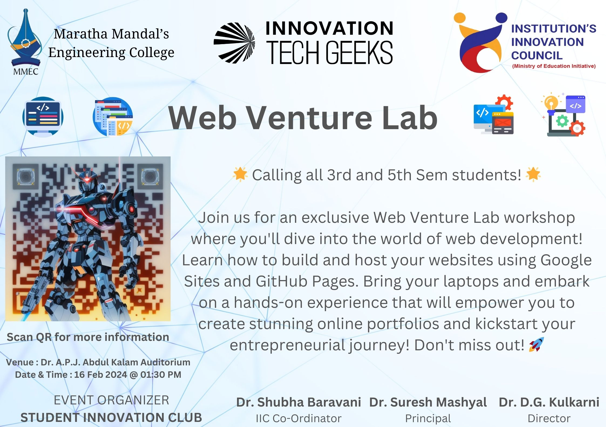

## 🚀 Unleash Your Digital Potential

Are you ready to embark on an exciting journey into the world of web development? Look no further than the Web Venture Lab workshop, where you'll unlock the secrets of building and hosting your websites from scratch! Whether you're a seasoned coder or a complete novice, this workshop is designed to empower you with the skills and knowledge you need to succeed in the digital age.

## 🎨 Discover Your Creative Edge

Hosted by the Student Innovation Club at Maratha Mandal Engineering College, the Web Venture Lab workshop is your ticket to unleashing your creativity and tapping into your digital potential. Guided by experienced mentors and industry experts, you'll learn how to harness the power of Google Sites to bring your ideas to life in the digital realm. From crafting captivating layouts to adding dynamic content, you'll have the tools and support you need to create websites that stand out from the crowd.

## 💻 Hands-On Learning, Real-World Skills

At the heart of the Web Venture Lab workshop is hands-on learning. Armed with your laptops and fueled by your imagination, you'll dive headfirst into the world of web development, putting theory into practice as you build your website from the ground up. But that's just the beginning! With the help of Google Takeouts, you'll learn how to extract the code from your Google Sites project, paving the way for your next adventure: GitHub.

## 🌐 GitHub: Your Gateway to the Web

With your code in hand, you'll journey into the realm of version control and collaboration with GitHub. Under the guidance of our expert mentors, you'll push your website code to a repository on GitHub and explore the powerful features of GitHub Pages. From there, the sky's the limit as you publish your website for the world to see, marking the culmination of your hard work and dedication.

## 🌟 Empowering Tomorrow's Innovators

But the Web Venture Lab workshop isn't just about building websites – it's about empowering tomorrow's innovators to shape the future of the web. Whether you dream of launching your own business, showcasing your portfolio, or simply expressing yourself online, this workshop will equip you with the skills and confidence you need to succeed. So why wait? Join us for the Web Venture Lab workshop and take the first step towards realizing your digital dreams!
\

### 🔥 Don't Miss Out

Ready to take the plunge into web development? Don't miss out on this exciting opportunity to learn, create, and innovate with us at the Web Venture Lab workshop! Spaces are limited, so reserve your spot today and embark on a journey into the digital future! 

*Date: 16 February 2024*  
*Time: 01:30 PM*  
*Location: A.P.J. Abdul Kalam Auditorium, Maratha Mandal's Engineering College*

Don't miss out – reserve your spot today and embark on a journey into the digital future with the Web Venture Lab workshop!

## 📝 Register Now!
Secure your spot for the Web Venture Lab workshop by registering today! Stay ahead in the digital game and unleash your creativity. We can't wait to see you there!"

<iframe src="https://docs.google.com/forms/d/e/1FAIpQLSf55MkvzXgNfs_kYc1w6SMnf066uo-s3ewb7IvGuDT46M1tUA/viewform?embedded=true" width="100%" height="1460" frameborder="0" marginheight="0" marginwidth="0">Loading…</iframe>